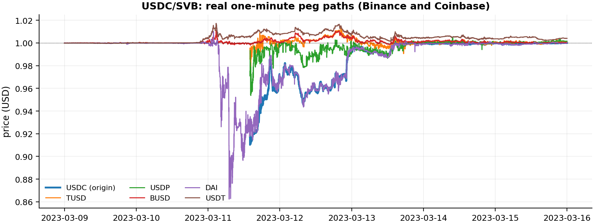
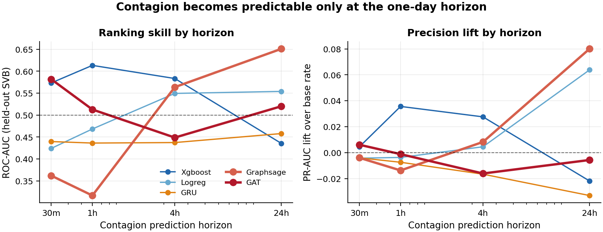
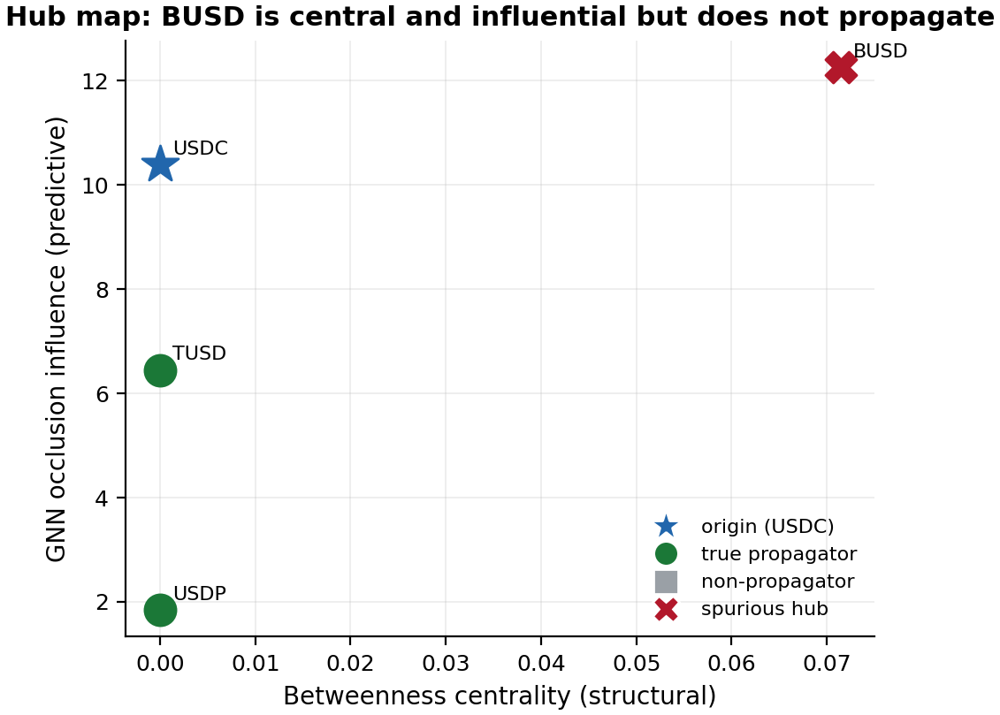

# Stablecoin Contagion GNN

[](https://github.com/nl2992/ICAIF_stablecoin-contagion-gnn/actions/workflows/ci.yml) [](LICENSE) [](environment.yml)

<p align="center">
  
</p>

<p align="center"><em>Real 1-minute prices during the USDC/SVB crisis: the *spread* of the drop across coins is the contagion this paper predicts.</em></p>

**Predictive, interpretable contagion propagation in stablecoin markets using temporal graph neural networks.**

> 📄 **Paper (compiled PDF):** [`paper/standalone_gnn_paper/main.pdf`](paper/standalone_gnn_paper/main.pdf)
> — *"Predicting Cross-Asset Stablecoin Contagion with Graph Attention Networks."* Real Binance+Coinbase data,
> leakage-safe evaluation, GAT +0.18 PR-AUC at 24h, edge ablation (+0.10), exported hub ranking.
> Headline results in [`RESULTS.md`](RESULTS.md); regenerate everything with [`reproduce.sh`](reproduce.sh).
> The companion causal-validation paper lives in the `stablecoin-abm` repo.

## Overview

This project models cross-stablecoin and cross-venue depeg propagation as a node-classification problem on a temporal graph. The approach follows the Uniswap paper's pipeline structure and integrates microstructure signals from the IAQF 2026 codebase.

**Core question**: Given a peg-stress event originating at node _i_ (asset × venue), which nodes _j_ will experience contagion within horizon Δ?

## Node universe

`(asset, venue, fee_tier)` triples across:

- **Assets**: USDC, USDT, DAI, FRAX, TUSD, USDe, PYUSD, BUSD
- **Venues**: Curve stableswap pools, Uniswap v3 stable pairs, Binance, Coinbase, Kraken

## Model ladder

| Model | Type | Input |
|---|---|---|
| Majority / Persistence | Baseline | labels |
| Logistic Regression | Linear tabular | node features |
| XGBoost | Nonlinear tabular | node features |
| LSTM | Sequential | per-node feature sequences |
| GraphSAGE | GNN | temporal graph |
| GAT | GNN + attention | temporal graph + edge features |

## Key design decisions

- **6-hour rolling edge window** — matches Uniswap paper edge construction
- **Chronological train/val/test split** across episodes — no shuffle, no leakage
- **Weighted-F1** as tuning metric — handles severe class imbalance
- **Synthetic episode augmentation** — StressBench block-resampling to escape n=1
- **Lead-time analysis** — horizons: 30 min, 1 h, 4 h, 24 h

## Node features

| Feature | Source |
|---|---|
| Price ratio (vs $1 peg) | IAQF fetch pipeline |
| Realized vol (1 h, 24 h) | IAQF |
| Log volume (1 h) | IAQF |
| Amihud illiquidity | IAQF |
| Kyle's λ | IAQF |
| OU half-life | IAQF |
| LOP wedge (cross-venue) | IAQF |
| TVL (USD) | DeFiLlama |

## Edge features

- Rolling 6-hour price correlation
- Cross-pool flow (USD)
- Lead-lag minutes (permutation-test cross-correlation)
- Shared LP percentage

## Repo layout

```
src/scgnn/
  data/        fetch, episode definitions, dataset builder
  graphs/      rolling graph construction (NodeID, builder)
  features/    node features, edge features, label construction
  models/      baselines, LR/XGB, LSTM, GraphSAGE, GAT
  train/       shared training loop, early stopping
  eval/        metrics, lead-time decay analysis
  interpret/   XGBoost gain ranking, GNNExplainer, hub centrality
train/         run_ladder.py — full model ladder entry point
eval/          lead_time_analysis.py
interpret/     hub_report.py
configs/       experiment.yaml — all hyperparams, episode list, split ratios
data/          episodes manifest, processed arrays (git-ignored raw/cache)
```

## Quickstart

```bash
pip install -e ".[dev]"

# 1. Fetch data and build dataset
python src/scgnn/data/fetch.py          # pulls 1-min OHLCV
python data/build_dataset.py            # assembles features + labels

# 2. Run full model ladder (60-min horizon)
python train/run_ladder.py --horizon 60

# 3. Lead-time analysis
python eval/lead_time_analysis.py --model graphsage

# 4. Hub report
python interpret/hub_report.py

# 5. Tests
pytest tests/
```

## Episodes

| Episode | Trigger | Dates |
|---|---|---|
| UST / Terra | UST | 2022-05-07 – 2022-05-13 |
| USDC / SVB | USDC | 2023-03-10 – 2023-03-15 |
| USDT Oct 2018 | USDT | 2018-10-14 – 2018-10-16 |
| USDT May 2022 | USDT | 2022-05-12 – 2022-05-14 |
| FRAX / SVB | FRAX | 2023-03-11 – 2023-03-16 |
| BUSD wind-down | BUSD | 2023-02-13 – 2023-02-17 |
| DAI crisis | DAI | 2022-11-09 – 2022-11-14 |
| + 200 synthetic | StressBench | block-resampled |

## Interpretability

- **XGBoost gain ranking** — global feature importance, top-20 features plotted
- **GNNExplainer** — per-node subgraph importance, surfaces contagion hubs
- **Hub centrality report** — betweenness × propagator label → identifies which stablecoins/pools amplify stress


<!-- readme-enhanced -->
## Figures



*Lead-time: contagion onset is unpredictable at hours but predictable at one day, where graph models clear chance.*



*Exported per-crisis hub ranking (correlational) — handed to the companion causal ABM, which overturns the top hub.*

## Reproduce (data → analysis → paper)

**Prerequisites.** Python 3.11. For the exact pinned environment use conda — `conda env create -f environment.yml && conda activate scgnn` — or with pip:
```bash
pip install -e .
```

**End-to-end pipeline.** Each step writes versioned artifacts consumed by the next:

```bash
# 1. Build the real multi-venue dataset (Binance + Coinbase, leakage-safe)
python scripts/build_real_dataset.py

# 2. Train + evaluate the full ladder (baselines → GraphSAGE → GAT) under LOCO
make train && make eval

# 3. Edge-rewiring null (topology vs edge count)
SCGNN_REWIRE_SEED=1 python scripts/run_loco.py --episode_set all_7 --model gat --horizon 1440

# 4. Export hub ranking + figures
make hubs && make figures

# 5. (or) everything end-to-end
bash reproduce.sh

```

The compiled paper is **`paper/standalone_gnn_paper/main.tex → main.pdf`**; every number and figure above is regenerated by the steps here.

**Exact reproduction.** Tested with Python 3.11. The committed dataset and `results/` tables are the exact published numbers; training is seeded (5-seed LOCO; edge-rewiring null via `SCGNN_REWIRE_SEED`). The real venue dataset is rebuilt from public Binance + Coinbase data via `scripts/build_real_dataset.py`; live archives may revise, so the committed artifacts are canonical for the published figures.
